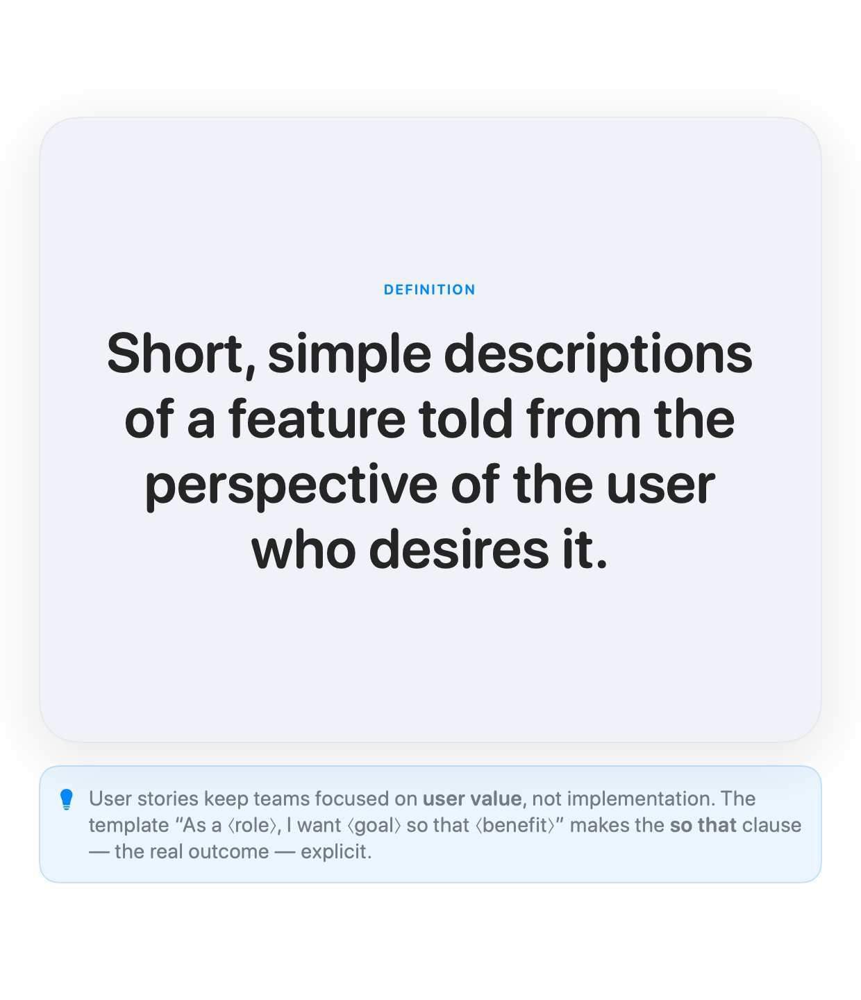
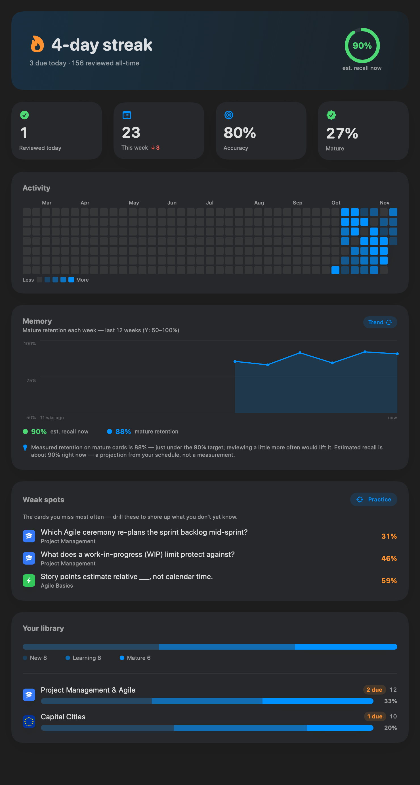

<h1 align="center">Flashcards</h1>

<p align="center">
  An ultra-clean, native flashcard app for <b>macOS and iPhone</b> — FSRS spaced repetition,<br>
  AI card generation, and local-first storage. One SwiftUI codebase. No accounts, no database, no cloud.
</p>

<p align="center">
  
  
  
</p>

<p align="center">
  
  &nbsp;&nbsp;
  
</p>

## Highlights

- **FSRS spaced repetition.** Modern memory-model scheduling (the algorithm behind today's Anki), seeded from each card's own history and tracked per direction. Grading is a calm three buttons — **Again / Good / Easy**.
- **Three answer modes, per card.** **Flip** a card, **type** the answer, or fill in a **cloze** deletion — `The {{c1::mitochondrion}} is the cell's powerhouse`.
- **Rich cards.** Inline **Markdown** and **LaTeX** (`$…$`) on both sides, accent-colored highlights (`==like this==`), and an optional **elaboration** — the "why / worked example / source" revealed under the answer.
- **Generate cards with AI.** Paste your notes, get a reviewable draft deck to edit and accept (OpenAI · Gemini · Anthropic). Your API key stays in the **Keychain**.
- **Insights that go deep.** Daily streak, true-retention trend, a GitHub-style activity heatmap, predicted recall, and **weak spots** to drill.
- **An editor that *is* the card.** You edit on the exact surface you study — a full-window **gallery** on macOS (hero card + filmstrip + add tile), a focused composer on iPhone. Fully keyboard-driven: **⌘N** to add, **Tab** to flip front↔back, **Return** to edit, **⌫** to delete.
- **Local-first and private.** Every deck is a human-readable **`.cards` JSON file** in a folder you choose. No database, no account, no sync — back up or share a deck by copying a file. (The AI features are the only network calls, and only when you ask.)

## Built with

- **SwiftUI**, multiplatform — one codebase compiles to macOS and iOS. Swift 6, strict concurrency.
- **SwiftData** as an in-memory working copy; the source of truth is the `.cards` files on disk, mapped through Codable DTOs.
- A pure, unit-tested **FSRS** scheduler (`Flashcards/Scheduling`).
- **SwiftMath** for native (vector) LaTeX typesetting — no web view.

## Build & run

The Xcode project is generated from `project.yml` by [XcodeGen](https://github.com/yonaskolb/XcodeGen), so it isn't checked in.

```bash
brew install xcodegen      # once, if needed
xcodegen generate          # creates Flashcards.xcodeproj
open Flashcards.xcodeproj   # then ⌘R — macOS, or pick an iOS Simulator
```

The app **ad-hoc signs** (`CODE_SIGN_IDENTITY = "-"`), so it builds and runs with no Apple Team ID. Installing on a *physical* iPhone needs your own signing identity.

## Storage

Each deck is a `.cards` file (pretty-printed JSON) in a library folder — `~/Documents/Flashcards` by default, and on macOS you can register several. The app loads them at launch, keeps an in-memory working copy, and rewrites the files after every change; external edits to the files are picked up live. There is **no on-disk database and no iCloud sync** — your cards never leave your machine.

## License

Free software under the **GNU General Public License v3.0** ([LICENSE](LICENSE)) — use it, study it, modify it, and share it; any distributed derivative must stay open under the same terms.

© 2026 Mike Psaras. As the copyright holder, the author reserves the right to also distribute the software under separate commercial terms (dual-licensing).

---

<p align="center"><sub>A solo project. Grab the latest build from <a href="https://github.com/mikepsaras/flashcard-app/releases/latest">Releases</a>.</sub></p>
